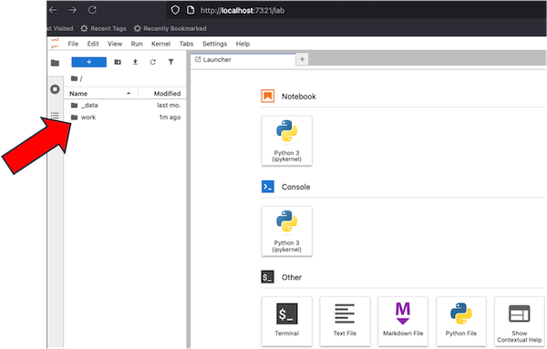
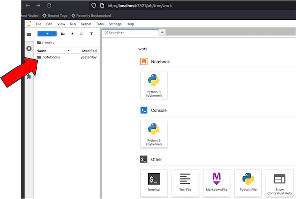
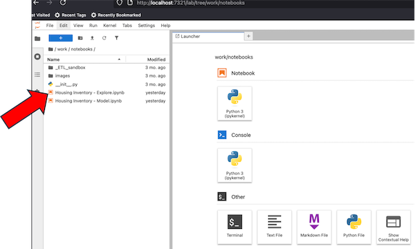
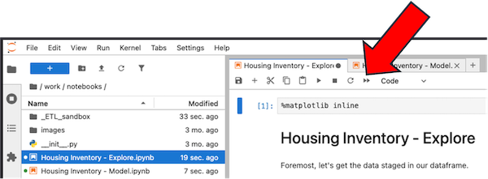
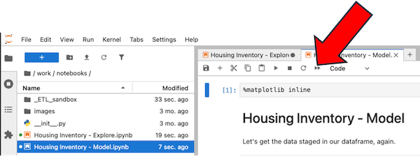

# Housing Inventory 
This repository contains the setup to analyze housing inventory data using a basic linear model. With data maintained in a SQLite database, the analysis in the Jupyter notebook file, and the entire ecosystem within a Docker container, everyone can verify the result with the exact same tools. Even better, everyone can extend the analysis for their own purposes with the exact same data.

## Setup  
-   Download and install [Docker Desktop](https://www.docker.com/products/docker-desktop/) for the Docker engine and Docker Compose; Docker Desktop is [free](https://www.docker.com/pricing/) for personal use\
-   Clone (with a git client) or download this repository
-   Make sure `Docker Desktop` is running on your system
-   Open a terminal / command line and navigate to where you cloned the directory
-   Start up the analysis environment:

``` zsh
docker compose -f compose-scs-jupyter.yml up
```

### Navigate to the local web interface for the application: 
[localhost:7321](http://localhost:7321)  

### In the left panel, click the `work` folder 
  

### Next click the `notebooks` folder 
  

### To walk through an exploration of the data, click `Housing Inventory - Explore`
  

### To re-run the notebook, click the arrows  to open the notebook   
  

### To walk through the development of a model and some predictive modeling, click `Housing Inventory - Model`
  

### To re-run the notebook, click the arrows to open the notebook   
  

## Shutdown  
-   Open a new command line / terminal and navigate to where you cloned the directory
-   Shutdown the analysis environment:

``` zsh
docker compose -f compose-scs-jupyter.yml down 
```